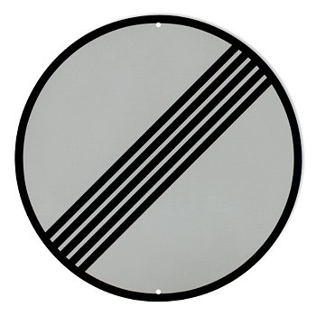
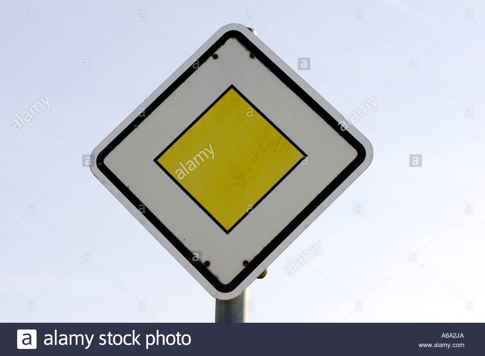
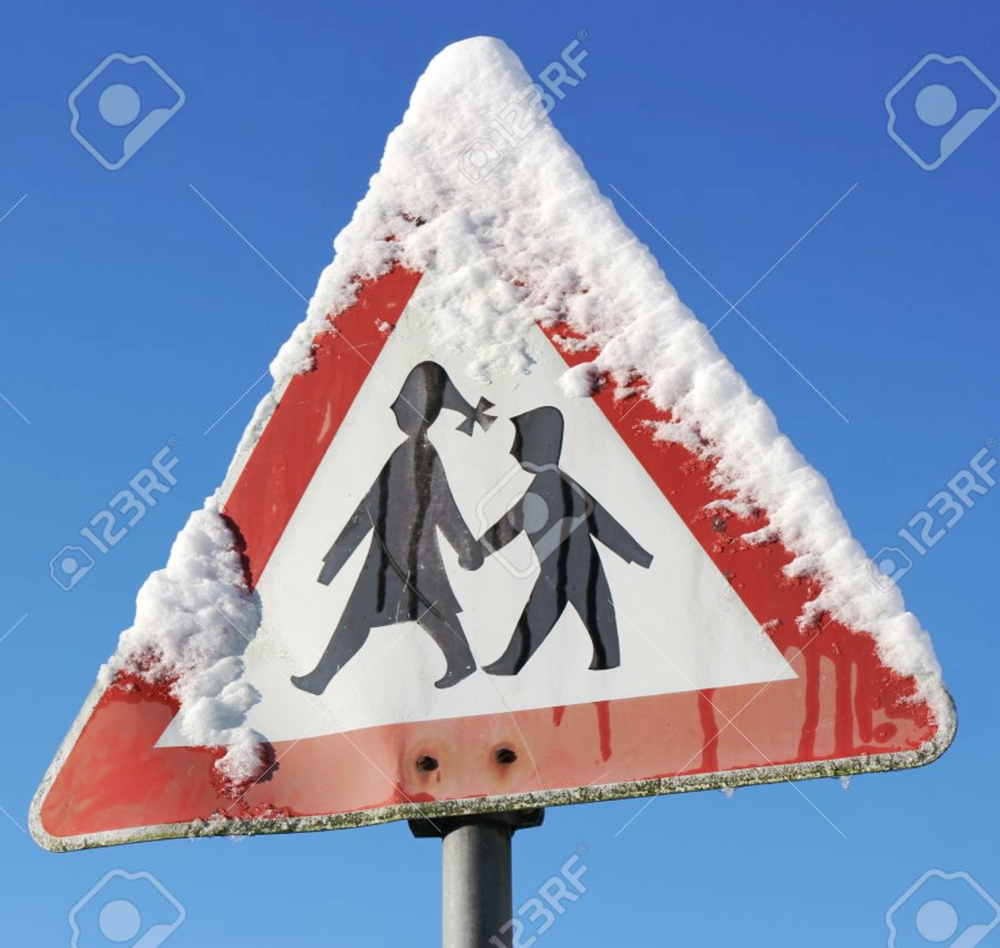
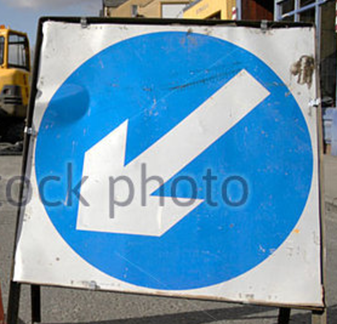
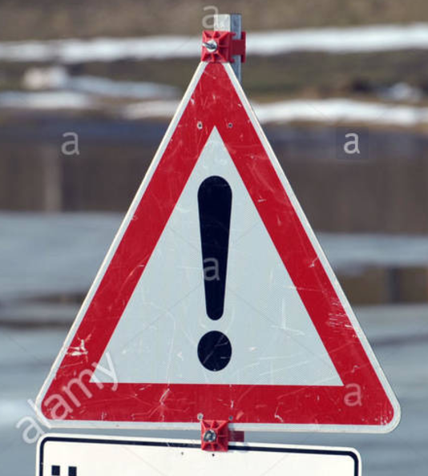

#**Traffic Sign Recognition**

##Writeup Template

###You can use this file as a template for your writeup if you want to submit it as a markdown file, but feel free to use some other method and submit a pdf if you prefer.

---

**Build a Traffic Sign Recognition Project**

The goals / steps of this project are the following:
* Load the data set (see below for links to the project data set)
* Explore, summarize and visualize the data set
* Design, train and test a model architecture
* Use the model to make predictions on new images
* Analyze the softmax probabilities of the new images
* Summarize the results with a written report

## Rubric Points
###Here I will consider the [rubric points](https://review.udacity.com/#!/rubrics/481/view) individually and describe how I addressed each point in my implementation.

---
###Writeup / README

####1. Provide a Writeup / README that includes all the rubric points and how you addressed each one. You can submit your writeup as markdown or pdf. You can use this template as a guide for writing the report. The submission includes the project code.

You're reading it! and here is a link to my [project code](https://github.com/grodowski/CarND-Traffic-Sign-Classifier-Project/blob/master/Traffic_Sign_Classifier.ipynb)

###Data Set Summary & Exploration

####1. Provide a basic summary of the data set and identify where in your code the summary was done. In the code, the analysis should be done using python, numpy and/or pandas methods rather than hardcoding results manually.

The code for this step is contained in the second code cell of the IPython notebook.

I used `numpy` to calculate summary statistics of the traffic signs data set:

Number of training examples = 34799
Number of testing examples = 12630
Image data shape = (32, 32, 3)
Number of classes = 43

####2. Include an exploratory visualization of the dataset and identify where the code is in your code file.

The code for this step is contained in the third code cell of the IPython notebook.

First I plotted a sample image from the dataset using

```
img_idx = 5010
img = X_train[img_idx]
plt.imshow(img)
plt.show()
```

Then, I created a histogram showing the distributions of classes in the training, validation and test sets. Please check it in the jupyter notebook output - the frequency of each class is correlated between train, valid and test datasets.

###Design and Test a Model Architecture

####1. Describe how, and identify where in your code, you preprocessed the image data. What tecniques were chosen and why did you choose these techniques? Consider including images showing the output of each preprocessing technique. Pre-processing refers to techniques such as converting to grayscale, normalization, etc.

The code for this step is contained in the fifth code cell of the IPython notebook.

As a first step, I decided to convert the images to grayscale because they would fit to the out-of-the box LeNet solution. Later I tried to tweak it to support RGB images but it didn't improve any scores (I measured AUC, accuracy and recall). It may seem that RGB channels don't carry much information that could help determine the sign class. So finally, I decided to submit a solution with grayscale.

I also introduced mean / variance normalization to those grayscale images.

####2. Describe how, and identify where in your code, you set up training, validation and testing data. How much data was in each set? Explain what techniques were used to split the data into these sets. (OPTIONAL: As described in the "Stand Out Suggestions" part of the rubric, if you generated additional data for training, describe why you decided to generate additional data, how you generated the data, identify where in your code, and provide example images of the additional data)

The code for splitting the data into training and validation sets is contained in the first code cell of the IPython notebook.

I decided to use data as is (testing, validation, training) from the original German roadsign dataset.

####3. Describe, and identify where in your code, what your final model architecture looks like including model type, layers, layer sizes, connectivity, etc.) Consider including a diagram and/or table describing the final model.

The code for my final model is located in the sixth cell of the ipython notebook.

I decided to use a canned LeNet solution with 32x32x1 inputs. I added L2 regularization and dropped the last convolutional layer. It incresed my accuracy by 0.1 (!) and didn't affect recall and AUC. Experiments with converting the network shape to support RGB images didn't help improve my scores.

####4. Describe how, and identify where in your code, you trained your model. The discussion can include the type of optimizer, the batch size, number of epochs and any hyperparameters such as learning rate.

The code for training the model is located from sixth to nineth cell of the ipython notebook.

Used AdamOptimizer, mostly following what has been presented in LeNet. I Increased the learning rate to 0.01 and added a decay of 0.1 on both parameters. I considered early stopping, but didn't use it. 25 learning epochs were enough to keep getting stable results.

####5. Describe the approach taken for finding a solution. Include in the discussion the results on the training, validation and test sets and where in the code these were calculated. Your approach may have been an iterative process, in which case, outline the steps you took to get to the final solution and why you chose those steps. Perhaps your solution involved an already well known implementation or architecture. In this case, discuss why you think the architecture is suitable for the current problem.

The code for calculating the accuracy of the model is located in the ninth cell of the Ipython notebook.

My final model results were:
* Validation set ACCURACY of 92%
* AUC score for test: 95.9%
* RECALL for test:  99%
* ACCURACY for test 90%

* What architecture was chosen?

LeNet without one convolutional layer (instead of 2) + regularization

* Why did you believe it would be relevant to the traffic sign application?

LeNet's was my choice, because its convolutional layers help generalize visual contents irrelevant of their position in the image.

* How does the final model's accuracy on the training, validation and test set provide evidence that the model is working well?

The model isn't perfect due to 90% accuracy, but with an AUC score of above 95% I am pretty sure it is able to generalize well. The difference in acurracy on validation and test is not big (about 2%), which is also a good sign.


###Test a Model on New Images

####1. Choose five German traffic signs found on the web and provide them in the report. For each image, discuss what quality or qualities might be difficult to classify.

Here are five German traffic signs that I found on the web:

  
 

The first image might be difficult to classify because the sign is partially covered with snow. In fact it's the only one that the classifierd failed to tag correctly!

####2. Discuss the model's predictions on these new traffic signs and compare the results to predicting on the test set. Identify where in your code predictions were made. At a minimum, discuss what the predictions were, the accuracy on these new predictions, and compare the accuracy to the accuracy on the test set (OPTIONAL: Discuss the results in more detail as described in the "Stand Out Suggestions" part of the rubric).

The code for making predictions on my final model is located in the tenth cell of the Ipython notebook.

Here are the results of the prediction:

[32 12 11 39 18]
[32 12 28 39 18]


| Image			        |     Prediction	        					|
|:---------------------:|:---------------------------------------------:|
| End of all speed and passing limits      		| End of all speed and passing limits   									|
| Priority road     			| Priority road 										|
| Children crossing					| Right-of-way at the next intersection											|
| Keep left	      		| Keep left					 				|
| General caution			| General caution      							|


The model was able to correctly guess 4 of the 5 traffic signs, which gives an accuracy of 80%

####3. Describe how certain the model is when predicting on each of the five new images by looking at the softmax probabilities for each prediction and identify where in your code softmax probabilities were outputted. Provide the top 5 softmax probabilities for each image along with the sign type of each probability. (OPTIONAL: as described in the "Stand Out Suggestions" part of the rubric, visualizations can also be provided such as bar charts)

The code for making predictions on my final model is located in the 11th cell of the Ipython notebook.

For the first image, the model is relatively sure that this is a stop sign (probability of 0.6), and the image does contain a stop sign. The top five soft max probabilities were

1. True label: **32 End of all speed and passing limits**

| Probability         	|     Prediction	        					|
|:---------------------:|:---------------------------------------------:|
| 1.0         			| 6 End of speed limit (80km/h)   									|
| 0.0     				| End of no passing 										|
| 0.0					| End of all speed and passing limits											|
| 0.0	      			| End of no passing by vehicles over 3.5 metric tons					 				|
| 0.0				    | Priority road      							|

2. True label: **12 Priority road**

| Probability           |     Prediction                    |
|:---------------------:|:---------------------------------------------:|
| 0.999972               | 12 Priority road                     |
| 0.0             | Yield                     |
| 0.0         | Speed limit (50km/h)                     |
| 0.0             | Turn left ahead                  |
| 0.0           | Right-of-way at the next intersection                   |

3. True label: **28 Children crossing**

| Probability           |     Prediction                    |
|:---------------------:|:---------------------------------------------:|
| 1.0               | Speed limit (60km/h)                     |
| 0.0             | Speed limit (80km/h)                     |
| 0.0         | Children crossing                     |
| 0.0             | Right-of-way at the next intersection                  |
| 0.0           | Speed limit (50km/h)                   |

4. True label: **39 Keep left**

| Probability           |     Prediction                    |
|:---------------------:|:---------------------------------------------:|
| 1.0               | Keep left                     |
| 0.0             | Yield                     |
| 0.0         | Speed limit (50km/h)                     |
| 0.0             | Speed limit (80km/h)                |
| 0.0           | Speed limit (60km/h)                 |

5. True label: **18 General caution**

| Probability           |     Prediction                    |
|:---------------------:|:---------------------------------------------:|
| 1.0               | General caution                     |
| 0.0             | Traffic signals         |
| 0.0         | Road work                     |
| 0.0             | Pedestrians                |
| 0.0           | Right-of-way at the next intersection                 |

It wasn't a suprise that this particular, snow-covered "Children crossing" sign wasn't classified corretly.
In this particular run, the classifier had trouble with "End of all speed limits", which it certainly
confused with other limit end or no passing end signs.
